# ALL SVG FORMS

Every card type **svgforge** can generate, with the rendered example and the
exact command that produces it. All examples below live in [`examples/`](./examples)
and were generated by [`examples/demo.json`](./examples/demo.json) with the
default `midnight` theme.

> In the commands below, `svgforge` means the CLI is on your PATH (`npm link`
> inside a clone). Without the link, use `node dist/cli.js` instead — the
> flags are identical. Without `-o`, every command writes the SVG to stdout.

**Contents:** [banner](#banner) · [wave](#wave) · [stats](#stats) · [skills](#skills) ·
[terminal](#terminal) · [badge](#badge) · [divider](#divider) · [progress](#progress) ·
[donut](#donut) · [chart](#chart) · [links](#links) · [quote](#quote) ·
[code](#code) · [project](#project) · [timeline](#timeline) ·
[contributions](#contributions) · [counter](#counter) · [sparkline](#sparkline) ·
[gauge](#gauge) · [radar](#radar) · [columns](#columns) · [rating](#rating) ·
[figure](#figure) · [mark](#mark) · [profile](#profile) · [steps](#steps) ·
[pills](#pills) · [callout](#callout) · [compare](#compare) · [social](#social) ·
[checklist](#checklist) · [cover](#cover) ·
[theme gallery](#theme-gallery) ·
[common flags](#common-flags-every-card) · [themes](#themes) · [manifests](#manifests)

---

## banner

Hero header with a diagonal gradient. Gradient IDs are unique per title, so
two banners on one README never paint each other. Default 880×160.

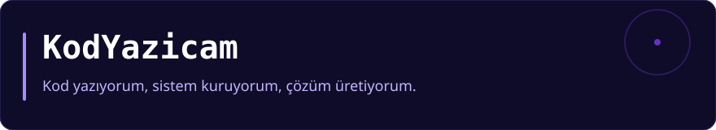

```bash
svgforge banner \
  --title "KodYazicam" \
  --subtitle "Kod yazıyorum, sistem kuruyorum, çözüm üretiyorum." \
  -o examples/banner.svg
```

| Flag | Effect |
| --- | --- |
| `--title` `--subtitle` | Main text (subtitle optional) |
| `--tag` | Small uppercase kicker above the title |
| `--logo` | Text/emoji mark before the title |
| `--gradient #aabbcc,#111111` | Custom two-stop gradient |
| `--flat` | Solid `--bg` fill instead of the gradient |

---

## wave

Capsule-render style header: three layered sine waves clipped to a rounded
card, title and subtitle centered. Default 880×200.


```bash
svgforge wave \
  --title "KodYazicam" \
  --subtitle "open source tooling" \
  -o examples/wave.svg
```

| Flag | Effect |
| --- | --- |
| `--title` `--subtitle` | Centered text |
| `--animate` | Translating wave layers (SMIL — experimental, best in browsers) |
| `--flat` | Solid background |

---

## stats

Label / value rows on an accent-edged card. Height grows one row per item.
Default 480 wide.

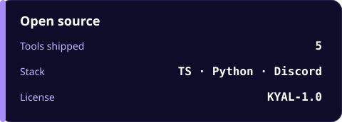

```bash
svgforge stats \
  --title "Open source" \
  --item "Tools shipped=5" \
  --item "Stack=TS · Python · Discord" \
  --item "License=KYAL-1.0" \
  -o examples/stats.svg
```

| Flag | Effect |
| --- | --- |
| `--title` | Card title (default "Stats") |
| `--item Label=Value` | One row each, repeatable |

---

## skills

Percentage bars. Levels are clamped to 0–100; non-numeric values become 0.
Default 520 wide.


```bash
svgforge skills \
  --title "Stack" \
  --item "TypeScript / Node=92" \
  --item "React / Next.js=88" \
  --item "Python / FastAPI=84" \
  --item "Discord.js=86" \
  --item "Docker / Linux=78" \
  -o examples/skills.svg
```

| Flag | Effect |
| --- | --- |
| `--title` | Card title (default "Skills") |
| `--item Name=level` | One bar each, repeatable |
| `--show-value` | Print `NN%` at the bar's end (opt-in) |

---

## terminal

A fake shell window: traffic-light dots, a title, and your lines. Lines that
start with the prompt marker (default `$`, or `>`) are painted in the accent
color. Default 720 wide.

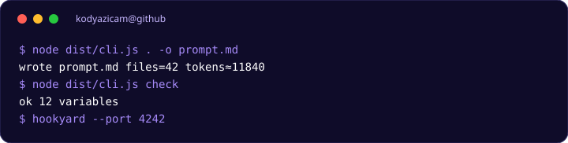

```bash
svgforge terminal \
  --title "kodyazicam@github" \
  --line '$ node dist/cli.js . -o prompt.md' \
  --line 'wrote prompt.md  files=42  tokens≈11840' \
  --line '$ node dist/cli.js check' \
  --line 'ok  12 variables' \
  --line '$ hookyard --port 4242' \
  -o examples/terminal.svg
```

| Flag | Effect |
| --- | --- |
| `--title` | Window title (default "terminal") |
| `--line text` | One line each, repeatable |
| `--prompt` | Prompt marker that triggers accent color (default `$`) |
| `--caret` | Blinking block caret (SMIL — experimental) |

---

## badge

A shields-style pill. Size adapts to the text length.


```bash
svgforge badge --label license --value KYAL-1.0 -o examples/badge.svg
```

| Flag | Effect |
| --- | --- |
| `--label` `--value` | Pill text |
| `--style flat\|outline\|plastic` | Flat (default), bordered, or glossy |
| `--label-color #rrggbb` | Left half color for `plastic` |

---

## divider

A thin separator line with an optional centered label pill. Bare dividers
get an accent segment in the middle. Default 880×40.


```bash
svgforge divider --label "v2 cards" -o examples/divider.svg
```

| Flag | Effect |
| --- | --- |
| `--label` | Text in a pill; omit for a bare line |

---

## progress

One milestone bar with the percent printed top-right and an optional caption.
`--value` accepts `68` or `68%`; anything non-numeric becomes 0. Default 480 wide.

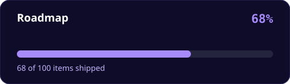

```bash
svgforge progress \
  --title "Roadmap" \
  --value 68 \
  --caption "68 of 100 items shipped" \
  -o examples/progress.svg
```

| Flag | Effect |
| --- | --- |
| `--title` | Card title (default "Progress") |
| `--value` | 0–100, clamped |
| `--caption` | Muted line under the bar |
| `--no-value` | Hide the top-right percent |

---

## donut

A ring chart with a legend. Segment colors rotate through the theme palette;
the legend shows `value · percent`. Values must sum above zero. Default 460 wide.

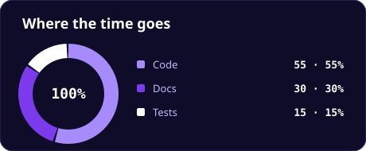

```bash
svgforge donut \
  --title "Where the time goes" \
  --item "Code=55" \
  --item "Docs=30" \
  --item "Tests=15" \
  --center "100%" \
  -o examples/donut.svg
```

| Flag | Effect |
| --- | --- |
| `--title` | Card title (default "Donut") |
| `--item Label=value` | One segment each, repeatable |
| `--center` | Text in the ring's hole (e.g. a total) |
| `--unit` | Suffix on legend values (`%`, `h`, …) |

---

## chart

Horizontal bars for **raw values** — the largest value gets the full bar, no
0–100 clamping (that's `skills`). The value is printed at the bar's end.
Default 520 wide.

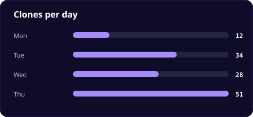

```bash
svgforge chart \
  --title "Clones per day" \
  --item "Mon=12" \
  --item "Tue=34" \
  --item "Wed=28" \
  --item "Thu=51" \
  -o examples/chart.svg
```

| Flag | Effect |
| --- | --- |
| `--title` | Card title (default "Chart") |
| `--item Label=value` | One bar each, repeatable |
| `--unit` | Suffix on printed values (`k`, `%`, …) |

---

## links

A row of pill buttons. Only `http(s)` URLs are accepted — anything else exits
with an error. Anchors work on your own site; GitHub renders repo images via
``, so links are decorative there (`--no-link` drops them).


```bash
svgforge links \
  --item "GitHub=https://github.com/KodYazicam" \
  --item "ctxpack=https://github.com/KodYazicam/ctxpack" \
  --item "svgforge=https://github.com/KodYazicam/svgforge" \
  -o examples/links.svg
```

| Flag | Effect |
| --- | --- |
| `--item Text=URL` | One pill each, repeatable (URL optional) |
| `--no-link` | Render plain pills without anchors |

---

## quote

A pull-quote card with a typographic quote mark and right-aligned author.
Long text wraps to the card width. Default 560 wide.


```bash
svgforge quote \
  --text "No third-party render service. Your README images are files you commit." \
  --author "svgforge" \
  -o examples/quote.svg
```

| Flag | Effect |
| --- | --- |
| `--text` | The quote (required) |
| `--author` | Attribution line, prefixed with an em dash |

---

## code

A snippet window with traffic-light dots and per-token coloring: comments
(muted), strings, keywords, numbers, and call names. `--lang` picks the
comment style — hash languages (`py`, `sh`, …) skip `//` comments, and
`#aabbcc` hex colors are never mistaken for comments. Default 640 wide.

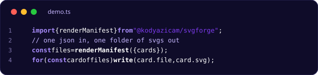

```bash
svgforge code \
  --title "demo.ts" \
  --lang ts \
  --line-numbers \
  --line 'import { renderManifest } from "@kodyazicam/svgforge";' \
  --line '// one json in, one folder of svgs out' \
  --line 'const files = renderManifest({ cards });' \
  --line 'for (const card of files) write(card.file, card.svg);' \
  -o examples/code.svg
```

| Flag | Effect |
| --- | --- |
| `--title` | Window title (defaults to `--lang`, else "code") |
| `--lang` | `ts`, `py`, `sh`, … — selects the comment style |
| `--line text` | One line each, repeatable |
| `--line-numbers` | Gutter with line numbers |

---

## project

A repo card: name, host line, wrapped description, evenly spaced stat
columns, and tag pills. Default 640 wide; height adapts to content.

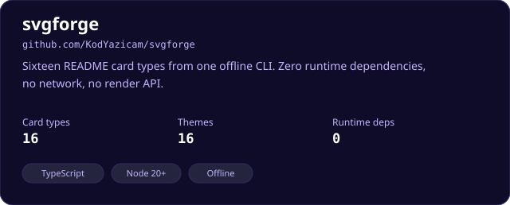

```bash
svgforge project \
  --name "svgforge" \
  --host "github.com/KodYazicam/svgforge" \
  --description "Sixteen README card types from one offline CLI. Zero runtime dependencies, no network, no render API." \
  --item "Card types=16" \
  --item "Themes=16" \
  --item "Runtime deps=0" \
  --tag "TypeScript" \
  --tag "Node 20+" \
  --tag "Offline" \
  -o examples/project.svg
```

| Flag | Effect |
| --- | --- |
| `--name` | Project name (required) |
| `--host` | Small mono line under the name |
| `--description` | Wrapped blurb |
| `--item Label=Value` | Stat columns, repeatable |
| `--tag text` | Tag pills, repeatable |

---

## timeline

A vertical milestone rail: date (mono, muted) and label per item; the last
dot uses the secondary accent. Default 560 wide.

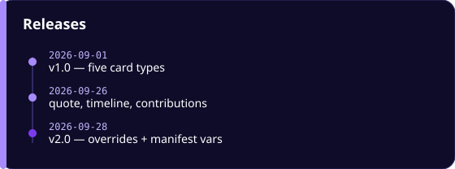

```bash
svgforge timeline \
  --title "Releases" \
  --item "2026-09-01=v1.0 — five card types" \
  --item "2026-09-26=quote, timeline, contributions" \
  --item "2026-09-28=v2.0 — overrides + manifest vars" \
  -o examples/timeline.svg
```

| Flag | Effect |
| --- | --- |
| `--title` | Card title (default "Timeline") |
| `--item Date=Label` | One milestone each, repeatable |

---

## contributions

A 52-week × 7-day heatmap. Five levels are derived from the theme by mixing
`bg` toward `accent` (see `levelColors`). Feed real data with `--file`, or
generate deterministic demo data with `--seed`.

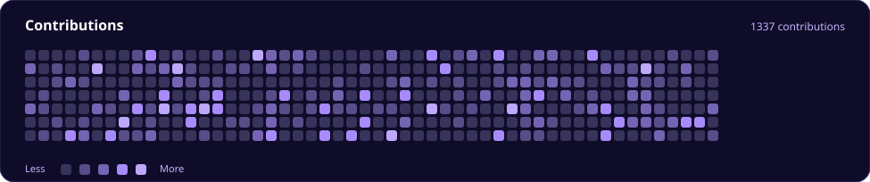

```bash
svgforge contributions \
  --title "Contributions" \
  --seed 42 \
  --total 1337 \
  -o examples/contrib.svg
```

| Flag | Effect |
| --- | --- |
| `--title` | Card title (default "Contributions") |
| `--seed n` | Deterministic demo data (seeded PRNG) |
| `--density 0.4` | Fill ratio for the demo data (0–1) |
| `--file weeks.json` | Real data: `[[0,1,2,...7 days], ...52 weeks]` or `{ "weeks": [...] }` |
| `--total n` | Count printed top-right |

The library exports `randomWeeks(seed, density)` and `levelColors(bg, accent)`
if you want to build weeks from your own commit data.

---

## counter

One big number. The font shrinks automatically when the text gets long.
Default 480×132.

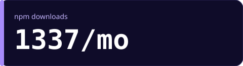

```bash
svgforge counter \
  --title "npm downloads" \
  --value 1337 \
  --suffix /mo \
  -o examples/counter.svg
```

| Flag | Effect |
| --- | --- |
| `--title` | Small label above the number |
| `--value` | The number (required) |
| `--prefix` `--suffix` | Text glued to the number (`$`, `/mo`) |

---

## sparkline

A line chart from a comma-separated list. The last point is highlighted and
printed at the bottom right. Default 560×190.

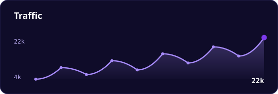

```bash
svgforge sparkline \
  --title "Traffic" \
  --values 4,9,6,12,8,15,11,18,14,22 \
  --unit k \
  --smooth \
  -o examples/sparkline.svg
```

| Flag | Effect |
| --- | --- |
| `--values 3,5,2,8` | At least two numbers |
| `--unit` | Suffix on the min, max, and last value |
| `--smooth` | Curve the line |
| `--no-area` | Hide the filled area under the line |

---

## gauge

A semicircle meter. Values below `--min` or above `--hi` pin to the ends
(0–100 by default). Default 420×220.

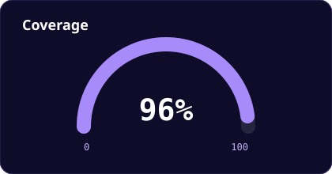

```bash
svgforge gauge --title "Coverage" --value 96 --unit % -o examples/gauge.svg
```

| Flag | Effect |
| --- | --- |
| `--value` | Current reading (required) |
| `--min` `--hi` | Range; readings outside it pin to the ends |
| `--unit` | Suffix on the printed value |

---

## radar

A polygon chart. Each `--item` is one axis, scored 0–100. Needs at least
three axes. Default 440×340.

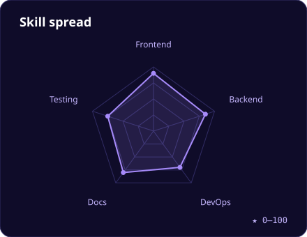

```bash
svgforge radar \
  --title "Skill spread" \
  --item "Frontend=90" \
  --item "Backend=85" \
  --item "DevOps=70" \
  --item "Docs=80" \
  --item "Testing=75" \
  -o examples/radar.svg
```

| Flag | Effect |
| --- | --- |
| `--item Axis=level` | One axis each, repeatable |
| `--levels` | Number of grid rings (2–6, default 4) |

---

## columns

Vertical bars scaled to the largest value. Default 560×260.

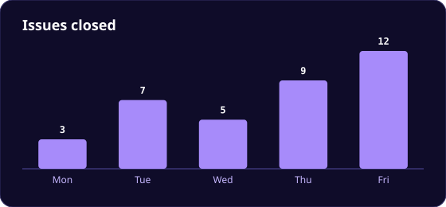

```bash
svgforge columns \
  --title "Issues closed" \
  --item "Mon=3" \
  --item "Tue=7" \
  --item "Wed=5" \
  --item "Thu=9" \
  --item "Fri=12" \
  -o examples/columns.svg
```

| Flag | Effect |
| --- | --- |
| `--item Label=Value` | One column each, repeatable |
| `--unit` | Suffix printed above the bar |

---

## rating

A star row with half stars. `--value 4.5` fills four and a half of five.
Default 380×132.


```bash
svgforge rating --title "Community rating" --value 4.5 --count 5 -o examples/rating.svg
```

| Flag | Effect |
| --- | --- |
| `--value` | Score, 0 to `--count` |
| `--count` | How many stars (1–10, default 5) |

---

## figure

A framed image. Only `https` URLs are accepted. Default 640×260.

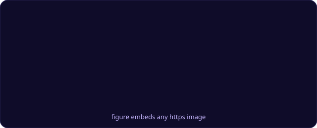

```bash
svgforge figure \
  --url "https://raw.githubusercontent.com/KodYazicam/svgforge/main/examples/wave.svg" \
  --caption "figure embeds any https image" \
  -o examples/figure.svg
```

| Flag | Effect |
| --- | --- |
| `--url` | https image (required) |
| `--caption` `--alt` | Caption under the image, and the accessible label |
| `--fit cover\|contain` | Crop to fill, or fit the whole image |

---

## mark

A monogram logo. One to three characters, centered on a gradient.
Default 160×160.


```bash
svgforge mark --letter K -o examples/mark.svg
```

| Flag | Effect |
| --- | --- |
| `--letter` | 1–3 characters (required) |
| `--shape circle\|square\|squircle` | Squircle is the default |
| `--gradient #aabbcc,#111111` | Custom two-stop fill |

---

## profile

Avatar initials, handle, bio, and a stat row.

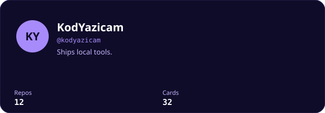

```bash
svgforge profile --name KodYazicam --handle @kodyazicam --bio "Ships local tools." --item Repos=12 --item Cards=32
```

## steps

Numbered list. Earlier steps are filled; the last one stays open.

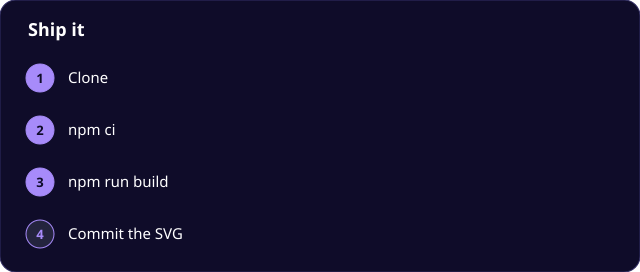

```bash
svgforge steps --title "Ship it" --item Clone --item "npm ci" --item "npm run build"
```

## pills

Wrapping chip cloud.


```bash
svgforge pills --title Stack --tag TypeScript --tag Node --tag SVG
```

## callout

A short note. `--tone` is `info`, `tip`, or `warn`.


```bash
svgforge callout --title "No network" --text "Commit the SVG." --tone tip
```

## compare

Two columns. Each row is `Label|left|right`.

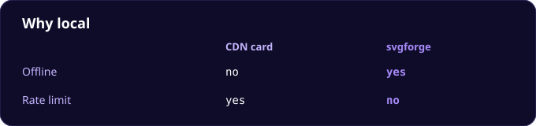

```bash
svgforge compare --left "CDN card" --right svgforge --item "Offline|no|yes"
```

## social

Name plus handle.


```bash
svgforge social --item "GitHub=@KodYazicam"
```

## checklist

Prefix a row with `done:` to check it.


```bash
svgforge checklist --title Release --item "done:Tests" --item Tag
```

## cover

A large hero. `--shadow` adds a soft drop shadow; it works on every card.

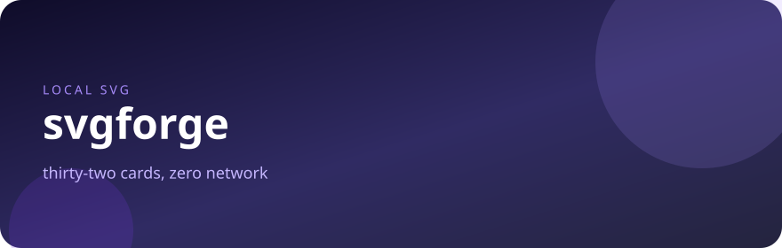

```bash
svgforge cover --kicker "local svg" --title svgforge --subtitle "zero network" --shadow
```

## Theme gallery

One banner per built-in theme. Same command, only `--theme` changes.

### midnight


```bash
svgforge banner --theme midnight --title midnight --subtitle "svgforge theme" --tag THEME
```

### tokyonight

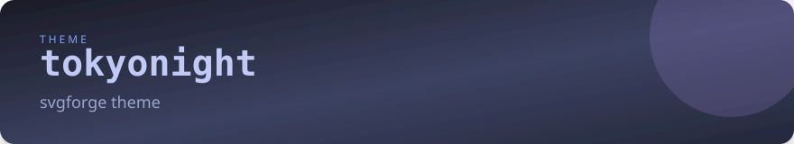

```bash
svgforge banner --theme tokyonight --title tokyonight --subtitle "svgforge theme" --tag THEME
```

### dracula

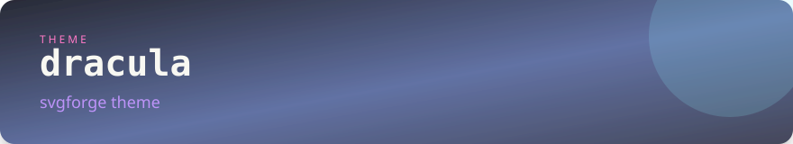

```bash
svgforge banner --theme dracula --title dracula --subtitle "svgforge theme" --tag THEME
```

### nord

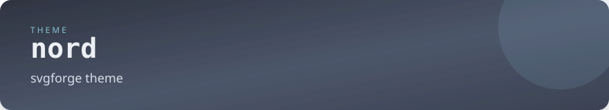

```bash
svgforge banner --theme nord --title nord --subtitle "svgforge theme" --tag THEME
```

### github

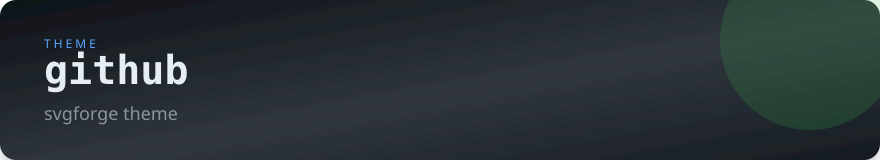

```bash
svgforge banner --theme github --title github --subtitle "svgforge theme" --tag THEME
```

### gruvbox

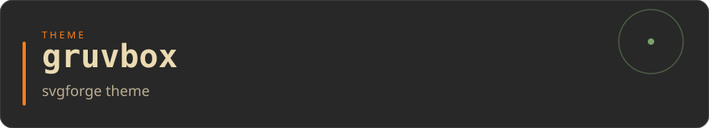

```bash
svgforge banner --theme gruvbox --title gruvbox --subtitle "svgforge theme" --tag THEME
```

### catppuccin

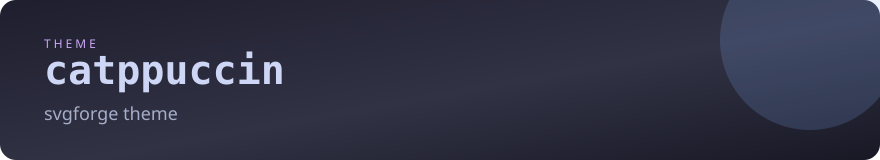

```bash
svgforge banner --theme catppuccin --title catppuccin --subtitle "svgforge theme" --tag THEME
```

### catppuccin-latte


```bash
svgforge banner --theme catppuccin-latte --title catppuccin-latte --subtitle "svgforge theme" --tag THEME
```

### onedark

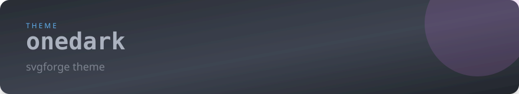

```bash
svgforge banner --theme onedark --title onedark --subtitle "svgforge theme" --tag THEME
```

### monokai

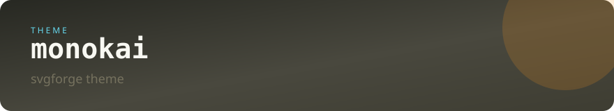

```bash
svgforge banner --theme monokai --title monokai --subtitle "svgforge theme" --tag THEME
```

### solarized

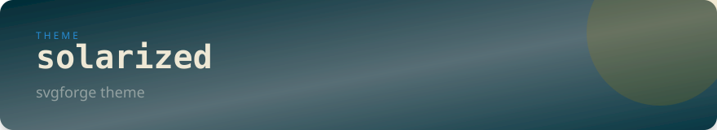

```bash
svgforge banner --theme solarized --title solarized --subtitle "svgforge theme" --tag THEME
```

### solarized-light

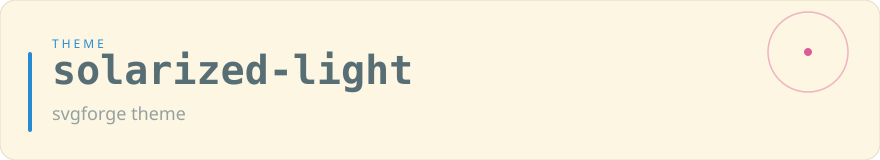

```bash
svgforge banner --theme solarized-light --title solarized-light --subtitle "svgforge theme" --tag THEME
```

### synthwave

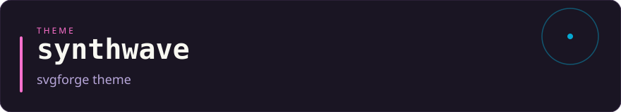

```bash
svgforge banner --theme synthwave --title synthwave --subtitle "svgforge theme" --tag THEME
```

### tokyo-night-storm


```bash
svgforge banner --theme tokyo-night-storm --title tokyo-night-storm --subtitle "svgforge theme" --tag THEME
```

### kanagawa

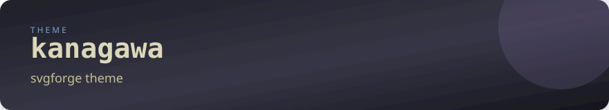

```bash
svgforge banner --theme kanagawa --title kanagawa --subtitle "svgforge theme" --tag THEME
```

### everforest

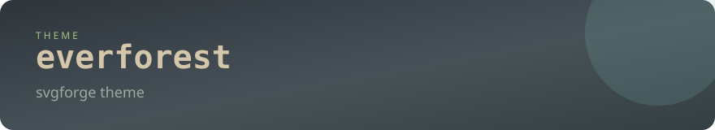

```bash
svgforge banner --theme everforest --title everforest --subtitle "svgforge theme" --tag THEME
```

### ayu

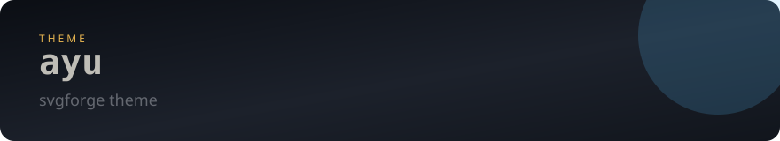

```bash
svgforge banner --theme ayu --title ayu --subtitle "svgforge theme" --tag THEME
```

### horizon

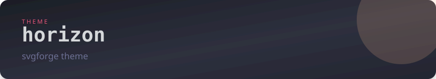

```bash
svgforge banner --theme horizon --title horizon --subtitle "svgforge theme" --tag THEME
```

### material

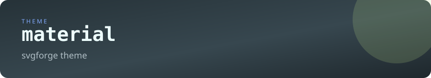

```bash
svgforge banner --theme material --title material --subtitle "svgforge theme" --tag THEME
```

### paper

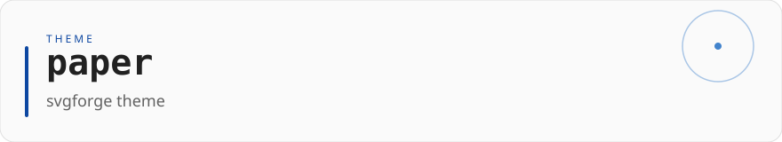

```bash
svgforge banner --theme paper --title paper --subtitle "svgforge theme" --tag THEME
```

### github-light


```bash
svgforge banner --theme github-light --title github-light --subtitle "svgforge theme" --tag THEME
```

### rose-pine

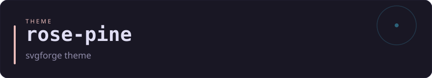

```bash
svgforge banner --theme rose-pine --title rose-pine --subtitle "svgforge theme" --tag THEME
```

## Common flags (every card)

| Flag | Effect |
| --- | --- |
| `--theme <name>` | One of the [themes](#themes) below (default `midnight`) |
| `--width <px>` `--height <px>` | Card size |
| `--radius <px>` | Corner radius |
| `--bg --bg2 --fg --muted --accent --accent2 --line-color <#rrggbb>` | Override one theme color at a time |
| `--font <family>` | Replace the font stack everywhere on the card |
| `--flat` | Solid background instead of a gradient (`banner`, `wave`) |
| `--border-width <px>` | Outline thickness; `0` hides the outline |
| `--shadow` | Soft drop shadow on the card |
| `--scale <0.1-4>` | Shrink or grow the rendered size; the viewBox stays the same |
| `-o, --out <path>` | Output file; omit for stdout |

Bad colors (`red`) and bad sizes (`--width abc`) exit 1 with the flag named
in the message. Examples:

```bash
# rebrand every card in one flag
svgforge banner --title ctxpack --bg "#0b1220" --accent "#38bdf8" --flat

# light README, tighter corners
svgforge stats --item "Stars=12" --theme paper --radius 4
```

## Themes

16 built in: `midnight` (default) · `tokyonight` · `dracula` · `nord` ·
`github` · `github-light` · `gruvbox` · `catppuccin` · `catppuccin-latte` ·
`onedark` · `monokai` · `solarized` · `solarized-light` · `synthwave` ·
`rose-pine` · `tokyo-night-storm` · `kanagawa` · `everforest` · `ayu` · `horizon` · `material` · `paper`

Unknown names fall back to `midnight`. Preview a whole theme in one shot:

```bash
svgforge demo --theme catppuccin -o ./preview   # one of every card type
svgforge themes                                 # list names
```

## Manifests

Every card above also works from a JSON manifest, where `"type"` selects the
card and the fields match the flags (`items`, `lines`, `weeks`, …). `{{var}}`
placeholders are replaced everywhere, and `--set` overrides them from the
command line:

```bash
svgforge render examples/demo.json -o examples/          # produced this gallery
svgforge render profile.json -o ./assets --set user=hookyard
```

```json
{
  "theme": "midnight",
  "vars": { "tool": "ctxpack" },
  "cards": [
    { "type": "banner", "title": "{{tool}}", "out": "banner.svg" },
    { "type": "badge", "label": "license", "value": "KYAL-1.0", "out": "badge.svg" }
  ]
}
```

Regenerate everything in this file after changing the generator:

```bash
npm ci && npm run build && npm run examples
```
